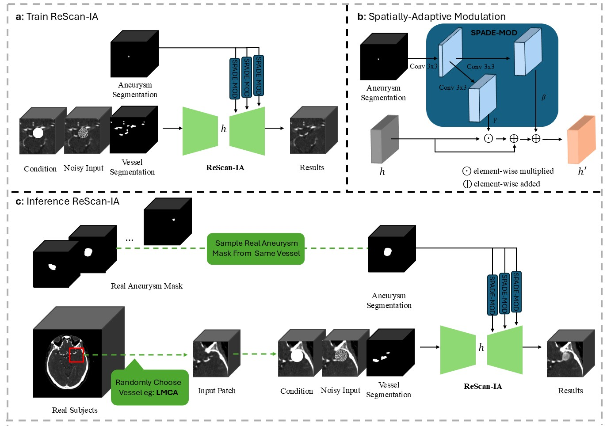
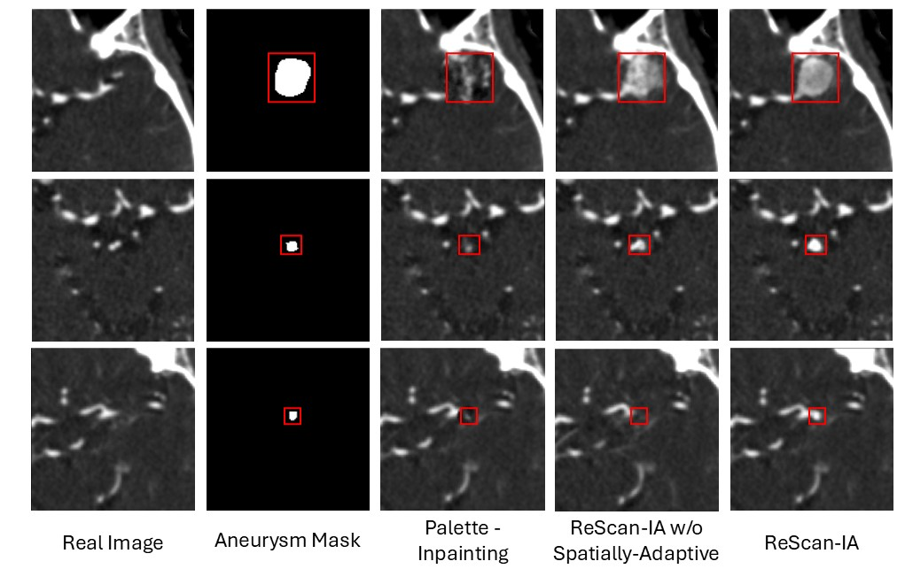
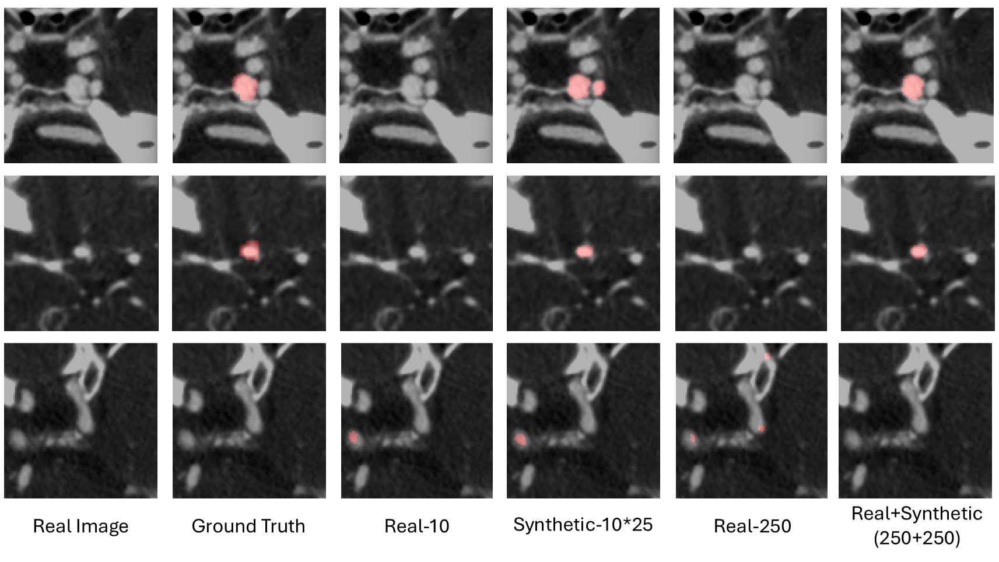

# ReScan-IA: A Spatially-Adaptive Diffusion Framework for Controllable 3D Intracranial Aneurysm Inpainting

> **MICCAI 2026 Submission** — Anonymized

---

## Overview

**ReScan-IA** is a spatially-adaptive 3D diffusion framework for controllable intracranial aneurysm (IA) synthesis in CTA volumes. We frame aneurysm insertion as a *virtual re-scan*: a clinically plausible aneurysm is introduced into an existing CTA volume as if it had been captured in a repeat acquisition, while preserving surrounding vascular anatomy.

The framework addresses two core challenges in IA data augmentation:
1. **Spatial controllability** — precise control over aneurysm location and morphology via decoder-level spatial modulation (3D SPADE).
2. **Anatomical consistency** — vessel-aware conditioning to enforce vascular continuity during inpainting.



**(a)** Training procedure with vessel-aware and spatial conditioning. **(b)** Spatially-adaptive feature modulation mechanism. **(c)** Downstream synthetic data generation and mask sampling strategy during inference.

---

## Key Results

### Quantitative Performance — External Dataset A & B

Segmentation (Dice) and detection (FP/case, Precision, Recall) on two independent external cohorts. Case-wise Dice reported with 95% CI. Best results per dataset in **bold**.

**External Dataset A**

| Method | Voxel Dice (%) | Case Dice (%) [95% CI] | FP / Case [95% CI] | Precision (%) [95% CI] | Recall (%) [95% CI] |
|---|:---:|:---:|:---:|:---:|:---:|
| Real-10 | 35.90 | 10.24 [4.10–16.38] | 1.93 [1.42–2.44] | 9.26 [3.36–15.16] | 30.00 [16.26–43.74] |
| Synthetic-250 | 42.83 | 21.95 [15.45–28.45] | 11.71 [10.50–12.92] | 5.39 [4.12–6.67] | **88.89** [79.34–98.44] |
| Real-250 | 41.11 | 11.17 [4.82–17.51] | 5.07 [4.49–5.66] | 3.81 [1.73–5.88] | 30.00 [16.26–43.74] |
| **Real+Synthetic (250+250)** | **62.24** | **24.65** [16.27–33.03] | **1.83** [1.49–2.16] | **19.02** [12.22–25.82] | 58.89 [44.11–73.67] |

**External Dataset B**

| Method | Voxel Dice (%) | Case Dice (%) [95% CI] | FP / Case [95% CI] | Precision (%) [95% CI] | Recall (%) [95% CI] |
|---|:---:|:---:|:---:|:---:|:---:|
| Real-10 | 19.46 | 9.88 [4.39–15.37] | **1.72** [1.15–2.28] | 12.81 [5.35–20.28] | 27.78 [14.36–41.20] |
| **Synthetic-250** | **35.20** | **18.80** [13.12–24.49] | 12.16 [11.30–13.03] | 5.15 [3.93–6.36] | **87.04** [77.32–96.76] |
| Real-250 | 28.58 | 12.00 [6.47–17.53] | 5.28 [4.67–5.90] | 4.85 [2.61–7.08] | 38.89 [24.61–53.17] |
| Real+Synthetic (250+250) | 28.06 | 16.57 [9.48–23.67] | 1.82 [1.51–2.14] | **18.08** [11.17–24.98] | 51.11 [36.26–65.96] |

### Qualitative Ablation — Image Generation Quality



*From left to right: real CTA, aneurysm mask, Palette baseline, ReScan-IA w/o spatial modulation, and full ReScan-IA. Palette fails to preserve vascular continuity; removing spatial modulation leads to poor morphological control. ReScan-IA achieves anatomically consistent and controllable synthesis.*

### Qualitative Ablation — Downstream Segmentation



*Synthetic-only training increases sensitivity but yields more false positives; real+synthetic training improves boundary accuracy and suppresses spurious detections.*

---

## Method

### Problem Formulation

Given a 3D CTA volume $x_0$, an inpainting mask $m$, a binary vessel mask $v$, and a spatial control mask $s$ specifying the target aneurysm location, ReScan-IA learns:

$$p_\theta(\hat{x} \mid x_0, m, v, s)$$

Context outside the mask is preserved via:

$$\hat{x} = (1-m) \odot x_0 + m \odot \tilde{x}$$

### Dual-Conditional Diffusion Architecture

At each denoising step, the 3D U-Net receives:

$$C_{\text{in}} = \text{concat}(x_t \odot m + x_0 \odot (1-m),\ x_{\text{bg}},\ v)$$

- **Input-level conditioning**: masked noisy input + background context $x_{\text{bg}} = (1-m) \odot x_0$ + vessel mask $v$
- **Feature-level conditioning**: 3D spatially-adaptive modulation in the decoder (see below)

### 3D Spatially-Adaptive Feature Modulation

Inspired by SPADE, we extend spatial modulation to volumetric feature maps. For a decoder feature map $h$ and spatial control mask $s$:

$$A = \text{ReLU}(\text{Conv}_{3\times3}(s))$$
$$\gamma(s) = \text{Conv}_\gamma(A), \quad \beta(s) = \text{Conv}_\beta(A)$$
$$h' = h \odot (1 + \gamma(s)) + \beta(s)$$

Spatial modulation is applied **exclusively in the decoder**, forming an asymmetric design: the encoder extracts stable anatomical representations, while the decoder integrates pathological structures guided by $s$.

### Training Objective

Spatially masked $\ell_1$ denoising loss, restricted to the inpainting region:

$$\mathcal{L} = \mathbb{E}_{x_0, \epsilon, t} \left[ \left\| m \odot \left( \epsilon - \epsilon_\theta(C_{\text{in}}, t, s) \right) \right\|_1 \right]$$

---

## Datasets and Preprocessing

- **Training**: 1,223 multi-center CTA volumes from [LargeIA](https://doi.org/10.1038/s41597-023-02430-4) and [RSNA Intracranial Aneurysm Detection](https://www.rsna.org/rsnai/ai-image-challenge/rsna-intracranial-aneurysm-detection-challenge-2023) datasets.
- **Evaluation**: Two independent external test cohorts (External A and External B), not used during training.

**Preprocessing pipeline** (applied uniformly to all datasets):
1. Resample to isotropic 0.5 mm spacing
2. Skull-stripping with [SynthStrip](https://surfer.nmr.mgh.harvard.edu/docs/synthstrip/)
3. HU clipping to [−50, 450]
4. Linear normalization to [−1, 1]

---

## Usage

### Environment

```bash
pip install -r requirements.txt
```

### Data Preparation

Prepare your CTA volumes with the following structure. Each subject requires:
- A CTA volume (NIfTI format)
- A binary vessel mask (Circle of Willis segmentation)
- An aneurysm mask (ground truth for training; user-defined for inference)

Modify the dataset configuration in the config file to point to your data:

```json
"which_dataset": {
    "name": ["data.dataset_spade_3d", "InpaintDataset3DSPADE"],
    "args": {
        "data_root": "your/data/path",
        "data_len": -1
    }
}
```

### Training

```bash
python run.py -p train -c config/SPADE/inpainting_3d_spade.json
```

**Training details**: 100,000 iterations, Adam optimizer (lr = 5×10⁻⁵), T = 1000 timesteps, linear noise schedule, 96×96×96 patch size, batch size 1.

### Inference / Synthetic Data Generation

```bash
python run.py -p test -c config/SPADE/inpainting_3d_spade.json
```

Inference uses 128×128×128 patches to provide increased spatial context. During inference, the spatial control mask $s$ serves as a user-defined signal to specify aneurysm location and morphology.

### Evaluation

```bash
python eval.py -s [ground_truth_path] -d [generated_samples_path]
```

---

## Repository Structure

```
├── config/
│   └── SPADE/                  # ReScan-IA configuration files
├── data/
│   └── dataset_spade_3d.py     # 3D CTA dataset with dual conditioning
├── models/
│   ├── model.py                # Diffusion model training/inference loop
│   └── network.py              # 3D U-Net with spatially-adaptive modulation
├── core/                       # Diffusion utilities (scheduler, logger, etc.)
├── preprocess/                 # CTA preprocessing scripts
├── run.py                      # Main entry point
└── eval.py                     # Evaluation metrics
```

---

## Acknowledgements

This codebase is built upon the [Palette: Image-to-Image Diffusion Models](https://arxiv.org/pdf/2111.05826.pdf) implementation by [Janspiry](https://github.com/Janspiry/Palette-Image-to-Image-Diffusion-Models), extended substantially for 3D volumetric medical image synthesis with dual conditioning and spatially-adaptive feature modulation.

Our work builds on the following:

**Theoretical foundations:**
- [Denoising Diffusion Probabilistic Models (Ho et al., NeurIPS 2020)](https://arxiv.org/pdf/2006.11239.pdf)
- [Palette: Image-to-Image Diffusion Models (Saharia et al., SIGGRAPH 2022)](https://arxiv.org/pdf/2111.05826.pdf)
- [Diffusion Models Beat GANs on Image Synthesis (Dhariwal & Nichol, NeurIPS 2021)](https://arxiv.org/abs/2105.05233)
- [Semantic Image Synthesis with Spatially-Adaptive Normalization / SPADE (Park et al., CVPR 2019)](https://arxiv.org/abs/1903.07291)

**Code references:**
- [openai/guided-diffusion](https://github.com/openai/guided-diffusion)
- [Janspiry/Palette-Image-to-Image-Diffusion-Models](https://github.com/Janspiry/Palette-Image-to-Image-Diffusion-Models)

---

## License

This project is released under the [MIT License](LICENSE).
